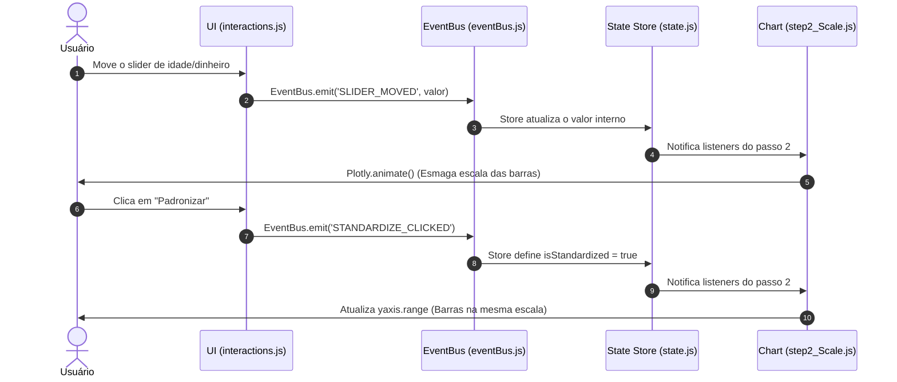

# 🏗️ Arquitetura de Software: Business Case PCA

---

## ℹ️ Informações Gerais
*   **Status:** Aprovado
*   **Padrão Arquitetural:** Client-Side MVC Modular (Event-Driven)
*   **Stack:** HTML5, CSS3 (Variáveis), Vanilla JS (ES6 Modules)

---

## 1. Visão Geral da Arquitetura

O projeto adota uma arquitetura baseada em **Módulos ES6** estritamente separada por responsabilidades. Como não há backend, todo o processamento simulado e gerenciamento de estado residem no navegador.

Para evitar o acoplamento excessivo (*Spaghetti Code*) comum em SPAs Vanilla JS, implementaremos um padrão **Event-Bus (Pub/Sub)** simplificado. Os componentes de UI nunca se comunicam diretamente; eles disparam eventos (ex: `USER_CLICKED_STANDARDIZE`) que atualizam um *Global State Object*. A UI apenas "reage" às mudanças desse estado.

### Stack e CDNs Obrigatórias (`index.html` `<head>`)
A importação das bibliotecas deve ser feita via CDN. As versões fixas garantem estabilidade:

```html
<!-- Plotly.js: Motor principal para os gráficos matemáticos (Dispersão, 3D, Heatmap) -->
<script src="https://cdn.plot.ly/plotly-2.27.0.min.js"></script>

<!-- D3.js: Manipulação de DOM para animações SVG complexas (se necessário para a Rotação) -->
<script src="https://d3js.org/d3.v7.min.js"></script>

<!-- GSAP: Motor de animações de UI e Scroll -->
<script src="https://cdnjs.cloudflare.com/ajax/libs/gsap/3.12.2/gsap.min.js"></script>
<script src="https://cdnjs.cloudflare.com/ajax/libs/gsap/3.12.2/ScrollTrigger.min.js"></script>
```

---

## 2. Estrutura de Diretórios (Árvore de Arquivos)

A IA deve gerar os arquivos respeitando estritamente esta hierarquia. **NÃO** crie um único arquivo `app.js` monolítico.

```text
/
├── index.html                # Único arquivo HTML (Estrutura do Scrollytelling)
├── /css
│   ├── main.css              # Reset, tipografia, variáveis CSS de cores
│   ├── layout.css            # Grid do Scrollytelling (Sticky right, Scroll left)
│   └── components.css        # Estilos de botões, sliders e tooltips
├── /js
│   ├── app.js                # Entry point (Bootstrap da aplicação)
│   ├── /core
│   │   ├── state.js          # Store global (Proxy ou Getters/Setters)
│   │   └── eventBus.js       # Sistema de Pub/Sub para comunicação entre módulos
│   ├── /data
│   │   ├── mockData.js       # Array JSON simulando o dataset de clientes
│   │   └── pcaMath.js        # Utilitários para transformações de dados (Z-score mock)
│   ├── /ui
│   │   ├── scrolly.js        # Configuração do IntersectionObserver/ScrollTrigger
│   │   └── interactions.js   # Listeners de botões e sliders do DOM
│   └── /charts
│       ├── chartManager.js   # Orquestrador central de gráficos
│       ├── step1_3D.js       # Renderiza o "Erro 3D" (Plotly 3D scatter)
│       ├── step2_Scale.js    # Renderiza as barras de Padronização
│       ├── step3_Cov.js      # Renderiza a "Batalha Naval" (Heatmap de Covariância)
│       ├── step4_Eigen.js    # Renderiza a nuvem de pontos com o Eixo animado
│       └── step5_Biplot.js   # Renderiza o Scatter 2D final com clusters coloridos
```

---

## 3. Gerenciamento de Estado (State Management)

Teremos um arquivo [state.js](file:///c:/Users/sergiogabriel/Desktop/Projetos/pca/js/core/state.js) que guarda o estado atual do "Mundo". Ele será um objeto reativo.

### Estrutura de Estado Prevista
```javascript
const initialState = {
  currentStep: 0,          // de 0 (Landing) a 5 (Projeção)
  step2: {
    sliderValue: 0,        // 0 a 100
    isStandardized: false  // true quando clica no botão
  },
  step4: {
    isRotated: false       // true após animação das avenidas
  }
};
```

### Mecanismo de Reatividade
A IA deve implementar uma classe `Store` com métodos `getState()`, `setState(key, value)` e `subscribe(listener)`. Toda vez que `setState` for chamado, a classe itera sobre os listeners registrados e notifica os componentes.

---

## 4. Detalhamento dos Módulos Principais (Contratos de Arquivos)

A IA deve seguir estes contratos de responsabilidade para os arquivos do core:

### 📄 [eventBus.js](file:///c:/Users/sergiogabriel/Desktop/Projetos/pca/js/core/eventBus.js)
*   **Responsabilidade:** Desacoplar módulos.
*   **Contrato:** Exportar um objeto com métodos `.on(event, callback)` e `.emit(event, payload)`.

### 📄 [mockData.js](file:///c:/Users/sergiogabriel/Desktop/Projetos/pca/js/data/mockData.js)
*   **Responsabilidade:** Fornecer os dados didáticos perfeitos.
*   **Contrato:** Exportar `rawData` (array de objetos com as 5 dimensões), `standardizedData`, `covarianceMatrix`, e `projectedData` (já calculados previamente para focar na UI, não precisando rodar o SVD real no browser).

### 📄 [chartManager.js](file:///c:/Users/sergiogabriel/Desktop/Projetos/pca/js/charts/chartManager.js)
*   **Responsabilidade:** Ponto de contato entre o Estado e os Gráficos.
*   **Contrato:** Deve escutar as mudanças de `currentStep`.
    *   *Exemplo:* Se `currentStep === 2`, ele chama o método `step2_Scale.render()` na div designada (`#chart-container`). Se sair do passo 2, ele limpa o contêiner usando `Plotly.purge('chart-container')`.

### 📄 [step4_Eigen.js](file:///c:/Users/sergiogabriel/Desktop/Projetos/pca/js/charts/step4_Eigen.js)
*   **Responsabilidade:** Atender à Epic 2 (US 2.3).
*   **Contrato:** Exportar função `render()` e `animateRotation()`. Deve usar Plotly para a nuvem de pontos e SVG/D3 ou Layout Shapes do Plotly para desenhar os "eixos" (linhas) que girarão usando transições para encontrar o "ângulo mais espalhado" (PC1).

---

## 5. Fluxo de Dados (Exemplo Prático: Passo 2)

Para ilustrar como as interações devem funcionar de ponta a ponta, usaremos o **US 2.1 (Padronização)** como caso de uso arquitetural:



1.  **Usuário Interage:** O usuário move o slider HTML (`<input type="range">`) da Idade vs Dinheiro.
2.  **UI Captura:** [interactions.js](file:///c:/Users/sergiogabriel/Desktop/Projetos/pca/js/ui/interactions.js) escuta o evento `input`.
3.  **Atualização de Estado:** [interactions.js](file:///c:/Users/sergiogabriel/Desktop/Projetos/pca/js/ui/interactions.js) dispara `EventBus.emit('SLIDER_MOVED', valor)`.
4.  **Estado Altera:** O módulo [state.js](file:///c:/Users/sergiogabriel/Desktop/Projetos/pca/js/core/state.js) escuta o evento, atualiza o valor no objeto interno.
5.  **Gráfico Reage:** [step2_Scale.js](file:///c:/Users/sergiogabriel/Desktop/Projetos/pca/js/charts/step2_Scale.js) (que está inscrito nas mudanças de estado do Passo 2) lê o novo valor e roda `Plotly.animate()` para mudar a altura das barras de "Idade" e "R$" em tempo real, ilustrando o esmagamento das escalas.
6.  **Finalização:** O usuário clica em "Padronizar". O EventBus emite `STANDARDIZE_CLICKED`. O Estado muda `isStandardized = true`. O [step2_Scale.js](file:///c:/Users/sergiogabriel/Desktop/Projetos/pca/js/charts/step2_Scale.js) atualiza os atributos de `layout.yaxis.range` do Plotly, colocando ambos na mesma escala visivelmente.

---

## 6. Estratégia de Scrollytelling (UI/UX)

A interface usará o padrão **Side-by-Side Scrollytelling** para desktop.

### Estrutura HTML Esperada
```html
<main class="scrolly-container">
  <article class="scroll-text">
    <section class="step" data-step="1">...</section>
    <section class="step" data-step="2">...</section>
    <!-- ... -->
  </article>
  <figure class="sticky-graphic">
    <div id="chart-container"></div> <!-- Onde o Plotly atuará -->
  </figure>
</main>
```

### Mecânica JS (`js/ui/scrolly.js`)
*   Utilizar a API nativa `IntersectionObserver` (ou GSAP `ScrollTrigger` configurado em modo `'snap'`).
*   Quando o topo de uma `.step` atinge o centro da tela (`rootMargin: "0px 0px -50% 0px"`), o JS extrai o `data-step`, atualiza o `State.currentStep` e dispara a renderização gráfica correspondente.
*   A div `.sticky-graphic` terá `position: sticky; top: 0; height: 100vh;` no CSS para que o gráfico fique fixo enquanto o texto rola na lateral esquerda.

---

> [!TIP]
> **Nota para a IA Geradora de Código:** Siga estas premissas estritamente. Evite reatividade complexa (não simule um React virtual DOM). Use as capacidades nativas do `Plotly.react` para atualizações eficientes de gráficos.